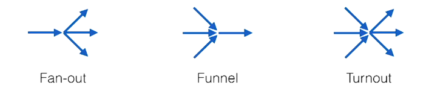

# golang-concurrency
- [Youtube Video](https://www.youtube.com/watch?v=YEKjSzIwAdA&t=1545s)
- [Slides](https://www.dropbox.com/s/wyxcw4gh2n5g1qw/concurrencypatterns.pdf?dl=0)

## Select statement

- [Fanout](concurrency/fanout.go)
- [Funnel](concurrency/funnel.go)
- [Turnout](concurrency/turnout.go)
## Channels Pitfalls
- Passing pointers to channels can cause race condition
- As channels work with copies of data, passing them large data chunks can cause performance issues
- Channels can create deadlocks
- Don’t use channels in front of naturally shared structures like caches or registries, because channels are about **not sharing** (i.e. the CSP concurrency model). - In such cases you need to use the sync and sync.atomic packages.

## Patterns for lock-less programming
- [Spinning Compare-And-Swap](concurrency/spinning-cas.go)
- [Ticket Storage](concurrency/ticket_storage.go)

## Guidelines for non-blocking code
- Avoid changing two thing at a time
- Avoid blocking
- Avoid race conditions
- Use channels to avoid sharing state
- When channels don't work use sync package